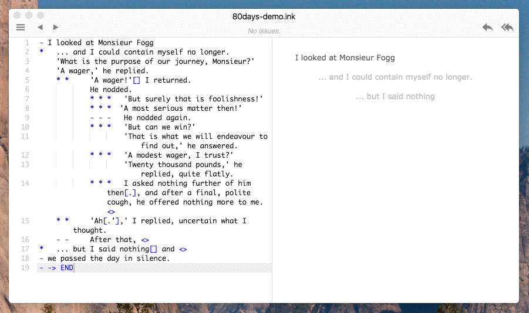

# Inky (*alpha*)

**Inky** is a editor for [ink](http://www.inklestudios.com/ink), inkle's markup language for writing interactive narrative in games, as used in [80 Days](http://www.inklestudios.com/80days). It's an IDE (integrated development environment), because it gives you a single app that lets you play in the editor as you write, and fix any bugs in your code.

## Features

- **Play as you write**: The play pane remembers the choices that you made, so when Inky recompiles, it fast-forwards to the last point you were at in the flow.
- **Syntax highlighting**
- **As-you-type error highlighting**. Inky is constantly compiling, allowing you to fix errors early.
- **Issue browser**: Lists errors, warnings and TODOs in your **ink**,  and allows you to jump to the exact line number and file in the source.
- **Jump to definition**: Divert targets (like `-> theStreet`) are hyperlinked can be followed by alt-clicking.
- **Support multi-file projects**: - Inky automatically infers your story's structure from the `INCLUDE` lines, meaning that there's no need for an additional project file. To create a new include file, simply type `INCLUDE yourfile.ink` where you want to include it.
- **Export to JSON**: Although this isn't necessary if you're using the [ink-Unity-integration plugin](https://www.assetstore.unity3d.com/en/#!/content/60055), Inky allows you to export to ink's compiled JSON format, which is especially useful in other ink runtime implementations, such as [inkjs](https://github.com/y-lohse/inkjs), for running **ink** on the web.
- **File watching**: Modern text editors, including Inky, watch for changes to files on disk, so that if you change them it reflects those changes. This is especially helpful if you keep your **ink** in source control.

## Project status

Inky is in alpha, is relatively untested, and is certain to have some bugs. It is also likely to be missing some major features that you might expect in a text editor like [Sublime Text](https://www.sublimetext.com/).

The informal [TODO.md](TODO.md) lists some missing features and known issues. If you want to discuss one, or request a new fix or feature, please [create a github issue](http://www.github.com/inkle/inky/issues).

To keep up to date with the latest news about ink [sign up for the mailing list](http://www.inklestudios.com/ink#signup).

## Download

### Mac, Windows and Linux

[Download the latest release](http://www.github.com/inkle/inky/releases/latest)

## Implementation details

Inky is built using:

* [Electron](http://electron.atom.io/), a framework by GitHub to build cross-platform Desktop app using HTML, CSS and JavaScript.
* [Ace](https://ace.c9.io/#nav=about), a full-featured code editor built for the web.
* [Photon](http://photonkit.com/), for some of the components. However, the dependency could probably be removed, since its only used for small portions of the CSS.

Inky includes a copy of **inklecate**, the command line **ink** compiler.

## Help develop Inky!

Take a look at the [issues page](https://github.com/inkle/inky/issues) for an issue with a "help wanted" label. We try to provide some basic instructions on how to get started with the development of the feature whenever we add the label.

To build the project:

* Install [node.js](https://nodejs.org/en/) if you don't already have it
* Clone the repo
* On Mac, double-click the `INSTALL_AND_RUN.command` script. On Windows, open Powershell, cd into the app directory, and type `npm install`, then `npm start`.
* For subsequent runs, if no npm packages have changed, you can run the `RUN.command` script on Mac, or type `npm start` in the shell (on Windows).

### Linux
* Install [node.js](https://nodejs.org/en/) if you don't already have it
* Install Wine (This is needed for the compiler not to actually run Inky)
* In the terminal run ./INSTALL_AND_RUN.command
* cd into the app directory, and type `npm install`, then `npm start`.

## License

**Inky** and **ink** are released under the MIT license. Although we don't require attribution, we'd love to know if you decide to use **ink** a project! Let us know on [Twitter](http://www.twitter.com/inkleStudios) or [by email](mailto:info@inklestudios.com).

### The MIT License (MIT)
Copyright (c) 2016 inkle Ltd.

Permission is hereby granted, free of charge, to any person obtaining a copy of this software and associated documentation files (the "Software"), to deal in the Software without restriction, including without limitation the rights to use, copy, modify, merge, publish, distribute, sublicense, and/or sell copies of the Software, and to permit persons to whom the Software is furnished to do so, subject to the following conditions:

The above copyright notice and this permission notice shall be included in all copies or substantial portions of the Software.

THE SOFTWARE IS PROVIDED "AS IS", WITHOUT WARRANTY OF ANY KIND, EXPRESS OR IMPLIED, INCLUDING BUT NOT LIMITED TO THE WARRANTIES OF MERCHANTABILITY, FITNESS FOR A PARTICULAR PURPOSE AND NONINFRINGEMENT. IN NO EVENT SHALL THE AUTHORS OR COPYRIGHT HOLDERS BE LIABLE FOR ANY CLAIM, DAMAGES OR OTHER LIABILITY, WHETHER IN AN ACTION OF CONTRACT, TORT OR OTHERWISE, ARISING FROM, OUT OF OR IN CONNECTION WITH THE SOFTWARE OR THE USE OR OTHER DEALINGS IN THE SOFTWARE.

-

*Inky is named after a black cat based in Cambridge, UK.*
